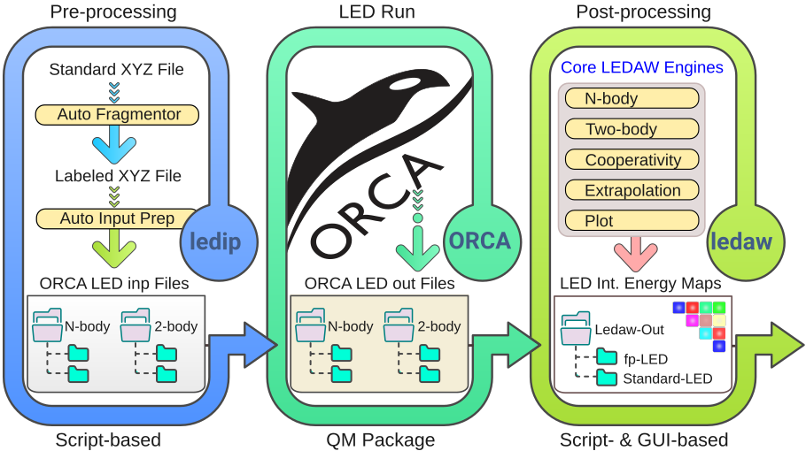
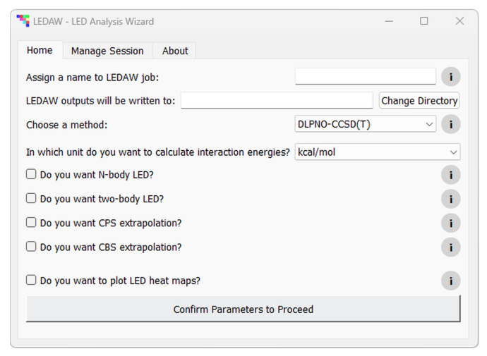

# **LEDAW: LED Analysis Wizard**  

## **A Python-Based Program Package for Automating Local Energy Decomposition Analysis: Script-Based ORCA Input Preparation and Output Post-Processing with GUI**  

### **Author**  
**Prof. Dr. Ahmet Altun**  
Max-Planck-Institut für Kohlenforschung  
Department of Molecular Theory and Spectroscopy  

---
## **Workflow of LEDAW**


---

## **Features**

### 🔹 LEDIP (Input Preparation)

- Automates ORCA input file generation for LED calculations.
- Supports **NBODY**, **TWOBODY**, and **BSSE-(un)corrected** setups.
- Automatically fragments XYZ structures using `fragmentation_engine()` based on atom connectivity, recognizing partial fragment labels.
- Provides a simple Python interface (`led_input_prep_engine()`) to generate `.inp` files for ORCA.
- Organizes input files into clean directory structures (e.g., `NBODY`, `TWOBODY`, etc.) with proper naming.

### 🔹 LEDAW (Output Processing)

- **LEDAW** automates all types of LED interaction energy analyses, including:
  - Interactions between arbitrary numbers of fragments (e.g., water cluster formation).
  - Interactions of single- or multi-fragment systems with other single- or multi-fragment systems (e.g., lattice energy calculations, duplex DNA formation with multiple fragments per strand).
- Features a **user-friendly, self-explanatory GUI** with built-in info buttons and help messages to guide users at every step.
- Includes example Python input scripts for users who prefer script-based workflows.
- Calculates **N-body, two-body, and cooperativity LED interaction energy matrices** for both standard and fragment pairwise (fp)-LED schemes from ORCA output files.
- Works with any number of fragments in the supersystem and its subsystems, independent of how fragments are labeled.
- Produces results and writes them to Excel files within seconds; generating heatmap figures may take a few minutes.
- Performs **Complete PNO Space (CPS)** and **Complete Basis Set (CBS) extrapolations** based on unextrapolated LED terms from ORCA outputs and generates corresponding energy matrices.
- **Automatically standardizes fragment labels** to match those in the supersystem file if they differ between supersystem and subsystem ORCA output files.
- Allows **relabeling of fragments** if the user wishes to adjust the fragment labeling in the supersystem ORCA output.
- Supports specifying an **alternative file** if the primary ORCA output file lacks certain required energy terms for N-body LED.
- Collects LED terms **method-specifically** (for DLPNO-CCSD(T), DLPNO-CCSD, and HFLD), including terms like London dispersion.
- Detects the use of **implicit solvation schemes** (CPCM, SMD, etc.) and distributes solute-solvent interaction contributions (reference and correlation dielectric terms and nonelectrostatic CDS) across pairwise terms.
- Automatically detects whether **BSSE correction** is requested and handles subsystem files accordingly.
- Writes **standard and fp-LED interaction energy matrices** into separate Excel files, with each matrix on a separate sheet.
- Provides **heatmaps** of all interaction energy matrices for convenient data interpretation and presentation.

---

## **How to Run**

### **Getting the Package**
Download (and then, unzip) or clone the entire LEDAW directory, including:
- `ledip_package` directory
- `ledaw_package` directory  
- `main.py`  
- `ledaw.spec`  
- `docs` directory (LEDAW manual)  
- `examples` directory containing:
  - `orca-outputs`: ORCA output files for several interaction types  
  - `ledaw-inputs`: Example Python scripts to run LEDAW on the `orca-outputs` files (intended for code-oriented users)
  - `ledip-inputs`: Example Python scripts to run LEDIP 

---

### **LEDIP Usage (Script-Based-Only)**

- No separate installation is needed. Run the LEDIP modules directly from Python.
- `fragmentation_engine.py` – Detects and labels molecular fragments from the XYZ file of the supersystem.
- `led_input_prep_engine.py` – Generates all required ORCA LED input files for N-body and two-body analyses, both with and without BSSE correction.
- Sample Python scripts to run these two engines are provided in the `/examples/ledip-inputs/` directory.
- Consult `LEDAW` manual in the `/docs` directory for options and detailed usage of these modules.

---

### **Installing LEDAW-GUI (Executable Generation)**

- **LEDAW-GUI** is pre-configured to generate an executable using **PyInstaller**. Hence, Python with Pyinstaller must be available on your system.
- To create the executable:

```bash
cd /path/to/the/LEDAW/directory
```

- Then, run the following command:

```bash
pyinstaller ledaw.spec
```

- The generated executable will work independently — Python does not need to be installed, and the source files are not required after compilation.

### **Running LEDAW-GUI Directly with Python**

- As an alternative to generating the executable, you can run LEDAW-GUI directly with Python:

```bash
cd /path/to/the/LEDAW/directory
```

- Then, run the following command:

```
python main.py
```

### **LEDAW-GUI Tabs**

- The **Home** tab of LEDAW-GUI is shown below. Based on the selections made in this tab, new tabs—**N-body**, **Two-body**, **Plot**, and **Run**—are 
dynamically generated. The contents of these tabs vary depending on the user's selections.



### **Running LEDAW without GUI (Script-Based Workflow)**

For code-oriented users, several example Python input scripts are provided for processing the files in the orca-outputs directory:

- **`water-dimer.py`**:  
  Performs BSSE-corrected and BSSE-uncorrected LED analyses, and computes differential BSSE effect on LED terms for a water dimer (two fragments).

- **`crystal.py`**:  
 Performs **N-body**, **two-body**, and **cooperativity** HFLD/LED analysis of the interaction between a central monomer and its environment in a crystal.

- **`dna-*.py`**:  
  Performs **N-body**, **two-body**, and **cooperativity** LED analysis of the inter-strand interaction energy in a DNA duplex. The four **dna-*.py** files are
  for BSSE-corrected and BSSE-uncorrected analyses using both DLPNO-CCSD(T) and HFLD.

- **`boat.py`**:  
  A comprehensive example that runs **all modules** of LEDAW, including CPS and CBS extrapolations on the DLPNO-CCSD(T)/LED terms for the boat conformer of water hexamer.

---

#### **Personalizing the Example Scripts**

- To adapt the provided scripts for your own system:
  - Update the **path and filenames** of the ORCA output files.
  - Update the **output path** where LEDAW should write the results.
  - **Comment out** or **remove** any analysis steps (e.g., N-body LED, two-body LED, cooperativity, CBS/CPS extrapolations) for which corresponding ORCA output files are unavailable or unnecessary.

---

#### **Recommended Workflow**

- Use **`boat.py`** to explore **all available modules**, including CPS and CBS extrapolations.  
  This script includes multiple file path specifications and several calls to the engine functions, demonstrating the full flexibility of LEDAW.
  For more detailed explanations on this system, consult the LEDAW manual.
 - Use **`dna-*.py`** scripts alongside the detailed explanations on this example in the LEDAW manual.
 - To practice the basic LEDAW logic and workflow, explore **`crystal.py`** and **`water-dimer.py`**.
   
---

## **References**

If you use any part of this code or its results in your research, in addition to the original LED, CPS, and CBS studies, please cite:

- **LEDAW GitHub Repository:**  
  [https://github.com/ahmetaltunfatih/LEDAW](https://github.com/ahmetaltunfatih/LEDAW)  

- **Main fp-LED Paper Summarizing the Theory behind LEDAW:**  
  [https://doi.org/10.1002/anie.202421922](https://doi.org/10.1002/anie.202421922) (Angew. Chemie. Int. Ed. 64/12, 2025, e202421922)
---

## **License**

### **Academic Use License (with Commercial Restriction)**

Copyright (c) 2025  
**Ahmet Altun**

Permission is hereby granted, free of charge, to any person obtaining a copy of this software and associated documentation files (the "Software"), to deal in the Software without restriction for **academic and non-commercial use**, including without limitation the rights to use, copy, modify, merge, publish, and distribute copies of the Software, subject to the following conditions:

> **Commercial use, including redistribution or incorporation into commercial products, is not permitted without prior written permission from the author. Please contact the author for commercial licensing.**

The above copyright notice and this permission notice shall be included in all copies or substantial portions of the Software.

> **Disclaimer:**  
> THE SOFTWARE IS PROVIDED "AS IS", WITHOUT WARRANTY OF ANY KIND, EXPRESS OR IMPLIED, INCLUDING BUT NOT LIMITED TO THE WARRANTIES OF MERCHANTABILITY, FITNESS FOR A PARTICULAR PURPOSE AND NONINFRINGEMENT. IN NO EVENT SHALL THE AUTHOR OR COPYRIGHT HOLDER BE LIABLE FOR ANY CLAIM, DAMAGES OR OTHER LIABILITY, WHETHER IN AN ACTION OF CONTRACT, TORT OR OTHERWISE, ARISING FROM, OUT OF OR IN CONNECTION WITH THE SOFTWARE OR THE USE OR OTHER DEALINGS IN THE SOFTWARE.

---
